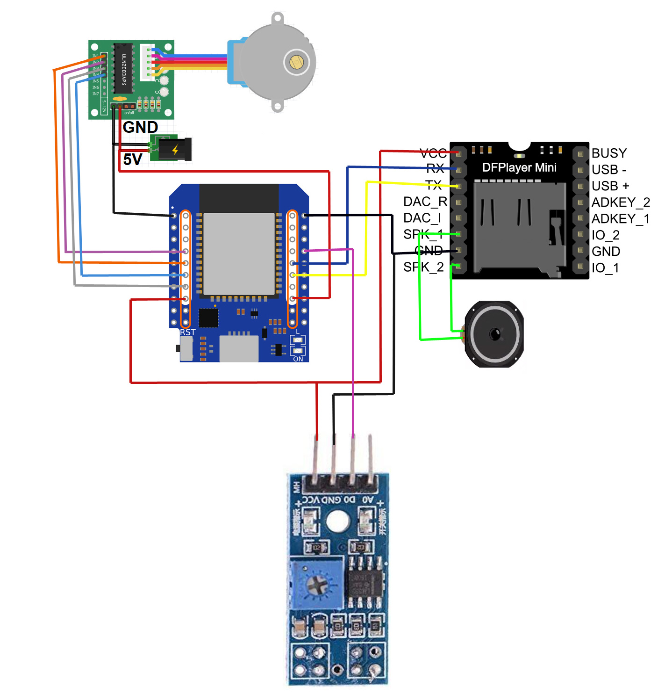

# Wandering Hour Clock

An improved version of 3D printed [wandering hour clock](https://www.printables.com/model/327198-improved-wandering-hour-clock).
Things I added:
- alternative SSID and password for WiFi connection (tries 5 times to connect with 1st SSID/PW and will than switch to 2nd SSID/PW) 
- sound output via DFplayer-module, strikes every hour and every 15 minutes (can be switched off via webinterface)
- automatic detection of DST (experimental)
- setting additional manual steps, e.g. for fine tuning of the position
- "easter egg", playing a certain soundfile at a specific date, e.g. a birthday song

## Instructions

### Hardware
- Ikea Bondis clock
- 3D printed parts and additional hardware listed from [Printables](https://www.printables.com/model/327198-improved-wandering-hour-clock), except ClockMovementGear and Standoffs
- 3D printed ClockMovementGear from [Printables](https://www.printables.com/model/429804-wandering-hour-clock-with-stepper-motor)
- Standoffs from [Printables](https://www.printables.com/model/476980-wandering-hour-clock-w-arduino-wifi-stepper-motor-)
- Any ESP board with wifi. e.g. ESP32, ESP8266
- 28BYJ-48 unipolar stepper motor
- ULN2003 motor driver
- Mini MP3 Player DFPlayer Module with SD card
- TCRT 5000  IR-sensor
- 5V power supply (preferrably with 2A+)
- Jumper wires

### Wiring Diagram

The ESP32 and the DFPlayer can be mounted on a PCB.

### SD-card for DFPlayer-module

The names and folders for the mp3-files on the  SD -card need to have a certain structure:
- 3 folders on the root path, called "01", "04", and "15"
- the files within the folders must be named in an nnn.mp3 format (a 3-digit number 000 - 999)
- 3 files in the folder "15" for the strikes at 15, 30 and 45 minutes (named "015.mp3",  "030.mp3" and "045.mp3")
- 1 file named "001.mp3" in folder "01" for the strikes at the full hour
- additional files within folder "15" for the sound at startup ("004.mp3") and for the (optional) 'easter egg'

### Arduino Sketch  (still under construction ....!)
- The arduino code in this project adds the following additional features
  - setting the stepper to idle after each move to save energy and avoiding the stepper to get hot
  - added NTP server of PTB Braunschweig (Germany)
  - additions on the web interface

### things I am working on

features I would like to implement / improve
- calibration of the stepper position every 12 hours using a IR sensor (unfortunately, the 28BYJ-48 usualy isn't that accurate as it was designed to open/close ventilation valves for cars, as far as I now)
- auto setting the time after startup

## Demo

(Image Credit: https://www.printables.com/model/327198-improved-wandering-hour-clock)
### Clock

### Web Server

### Preferences

Look up your [UTC offset](https://en.wikipedia.org/wiki/List_of_UTC_offsets) for standard time, and enter the value. If it is currently daylight saving time where you are, check the appropriate box. For example, in Newfoundland  (UTC-3:30) during the summer, the hour offset would be "-3", the minute offset would be "30" and the daylight saving time box should be checked.

The preference values are saved in non-volatile memory and will be retained after a power cycle. After making a change to the time zone, you will need to resynchronize the clock by using the web server to set the correct time.
